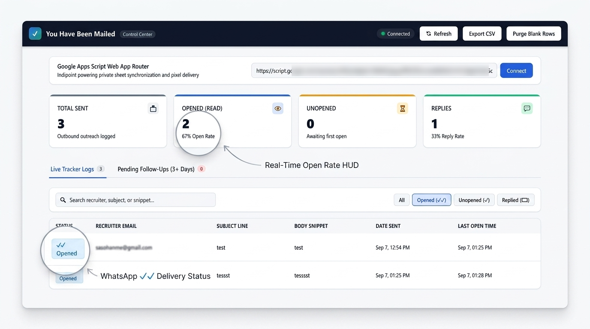
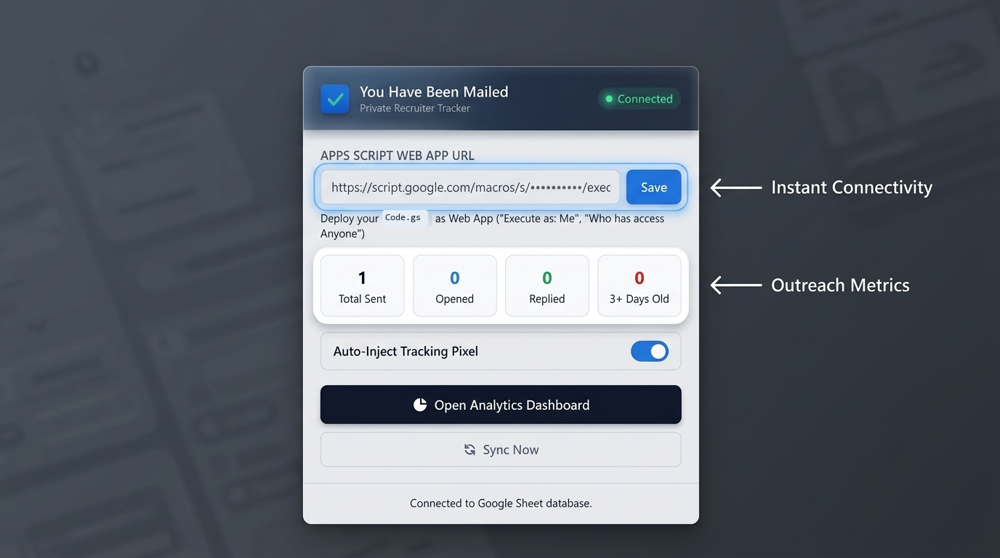
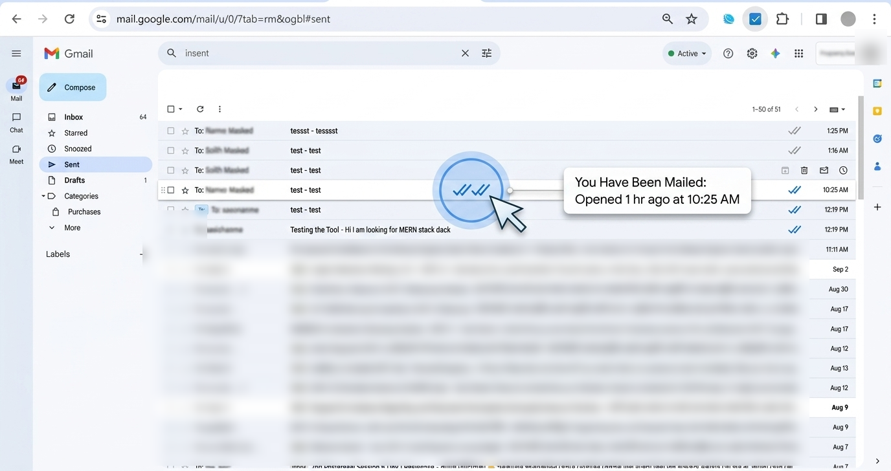

# You Have Been Mailed 📬

> **A 100% Free, Private, Zero-Spam-Risk Recruiter Email Tracking & Analytics Ecosystem for Gmail.**  
> Powered natively by Google Apps Script & Chrome Manifest V3. No monthly subscriptions. No third-party servers. No spam filter triggers.

[](https://developer.chrome.com/docs/extensions/mv3/intro/)
[](https://developers.google.com/apps-script)
[](https://github.com/sasohan0/you-have-been-mailed/releases/latest)
[](LICENSE)
[](#-why-you-have-been-mailed)

---

## ⚡ The Problem with Commercial Email Trackers

When job hunting or reaching out to recruiters, tools like Mailtrack, Mixmax, or Yesware route tracking links through shared, third-party domains. 

Enterprise recruiting security filters (Proofpoint, Mimecast, Barracuda) frequently flag these shared domains, routing outreach emails directly into **Spam** or **Promotions** tabs where recruiters never see them. Furthermore, commercial tools collect your recipient contact data on their servers and lock basic metrics behind expensive paywalls.

**You Have Been Mailed** solves this completely:
- 🔒 **100% Self-Hosted & Private**: Your tracking endpoint runs entirely on your own free Google Cloud Apps Script instance. All recipient data and open timestamps are saved directly to a private Google Sheet in **your personal Google Drive**.
- 🛡️ **Zero Spam Penalties**: Tracking requests execute strictly through trusted Google domains (`script.google.com`), bypassing spam flags.
- 💬 **WhatsApp-Style Delivery Indicators**: Shows checkmark badges directly in your Gmail Sent outbox:
  - `✓` **Single Gray Tick**: Sent & Delivered (Unopened).
  - `✓✓` **Double Blue Ticks**: Opened by Recruiter (hover to see exact timestamp!).
  - `✉️` **Green Envelope**: Recruiter has Replied.
- 📊 **Standalone Analytics Control Center**: Live metrics HUD, real-time searchable outreach logs, overdue thread tracking (>72h), and one-click bulk follow-up dispatch.
- 📦 **Instant ZIP Installation**: Download the ready-to-use release package with zero build tools or dependencies required.

---

## 📸 Visual Showcase & Feature Tour

### 1. Portable Analytics Command Center
High-DPI control center featuring real-time HUD open-rate calculations, filter pills (`Opened (✓✓)`, `Unopened (✓)`, `Replied (✉️)`), live outreach logs, and 72h+ candidate follow-up auto-bump pipeline:


### 2. Extension Quick Settings & Status HUD
Sleek glassmorphic extension popup showing zero-latency Google Apps Script connectivity, outbound outreach counters, auto-inject toggle, and instant sync:


### 3. Native WhatsApp-Style Checkmarks in Gmail
Delivery indicators rendered directly inside your Gmail Sent outbox (`#sent`) with full recipient privacy protection and hover timestamp cards:


---

## 🏛️ System Architecture

```
┌────────────────────────────────────────────────────────┐
│ 1. CLIENT: "You Have Been Mailed" Chrome Extension     │
│    - Intercepts Gmail send transit synchronously       │
│    - Scrapes recipient, subject & body snippet         │
│    - Injects invisible 1x1 transparent tracking pixel  │
│    - Blocks self-opens when viewing Sent mail          │
│    - Displays WhatsApp checkmark badges in #sent       │
└──────────────────────────┬─────────────────────────────┘
                           │
                           ▼ (Pixel Fetch / Outbound Log)
┌────────────────────────────────────────────────────────┐
│ 2. BACKEND: Google Apps Script Web App Engine          │
│    - doGet(): Serves transparent 1x1 GIF & logs opens  │
│    - getStatusSummary: Aggregates Sheet records        │
│    - doPost(): Batch thread replies (threads.reply())  │
│    - Auto-manages Google Sheet:                        │
│      "Private_Email_Tracker_Log"                       │
└──────────────────────────┬─────────────────────────────┘
                           │
                           ▼ (JSON Sync)
┌────────────────────────────────────────────────────────┐
│ 3. DASHBOARD: Portable Analytics Control Center        │
│    - Global Metrics HUD (Sent, Opened, Unopened, Reply)│
│    - Live Tracker Logs with search and WhatsApp ticks  │
│    - 3+ Days Overdue Pipeline (Threads > 72h)          │
│    - One-Click "Batch Send Auto-Bumps" follow-up tool  │
└────────────────────────────────────────────────────────┘
```

---

## 🚀 Beginner Quickstart (Complete 3-Step Setup)

No prior programming experience required. Setup takes under **3 minutes**.

### Step 1: Deploy Your Free Google Apps Script Backend (2 mins)

1. Open your browser and navigate to **[script.new](https://script.new)** (creates a new Google Apps Script project).
2. Name your project at the top: **`You Have Been Mailed Tracker`**.
3. Delete any default code in `Code.gs` and paste the complete code from **[`gas/Code.gs`](./gas/Code.gs)**.
4. Press **`Ctrl + S`** (or `Cmd + S`) to save.
5. Click the blue **Deploy** button (top right) ➔ **New deployment**:
   - Click the gear icon ⚙️ next to "Select type" ➔ Choose **Web app**.
   - **Description**: `v1 Production Tracker`
   - **Execute as**: `Me (your-email@gmail.com)`
   - **Who has access**: **`Anyone`**  
     *(⚠️ Important: Selecting "Anyone" allows recruiter email clients to fetch the transparent tracking pixel without being blocked by a Google login prompt).*
6. Click **Deploy**.
7. In the authorization dialog:
   - Click **Authorize access**.
   - Choose your Google account.
   - Click **Advanced** ➔ **Go to You Have Been Mailed Tracker (unsafe)**. *(This appears on all personal Apps Script projects because Google has not verified your own custom script).*
   - Click **Allow**.
8. Copy your **Web app URL** (it looks like: `https://script.google.com/macros/s/.../exec`).

---

### Step 2: Install the Chrome Extension (1 min)

#### Option A: Download Ready-to-Use ZIP (Easiest — No Git Required)
1. Go to the **[Latest Release](https://github.com/sasohan0/you-have-been-mailed/releases/latest)** page.
2. Download **`you-have-been-mailed-v1.0.0.zip`** and extract (unzip) it to a folder on your computer.

#### Option B: Clone via Terminal
```bash
git clone https://github.com/sasohan0/you-have-been-mailed.git
cd you-have-been-mailed
```

#### Load into Google Chrome
1. Open Google Chrome and go to `chrome://extensions` in the address bar.
2. Turn on **Developer mode** using the toggle switch in the top-right corner.
3. Click the **Load unpacked** button in the top-left corner.
4. Select the extracted `you-have-been-mailed` folder (or cloned directory).
5. Click the extension puzzle icon in Chrome's toolbar, find **You Have Been Mailed**, and pin it.
6. Click the **You Have Been Mailed** extension icon:
   - Paste your **Web app URL** from Step 1.
   - Click **Save**.
   - The status indicator will turn **Connected (Green)**!

---

### Step 3: Open the Analytics Dashboard

You can access your standalone analytics command center anytime:
- Click **Open Dashboard** directly from the Chrome Extension popup, OR
- Open [`dashboard/dashboard.html`](./dashboard/dashboard.html) directly in your browser.

Click **Connect** (or it will auto-connect using your saved extension settings). You are ready to go!

---

## 📬 WhatsApp Checkmarks in Gmail Sent Mail

Whenever you navigate to your Gmail **Sent** folder (`#sent`), delivery badges are automatically injected next to recipient names:

| Badge | Meaning | Description |
| :--- | :--- | :--- |
| `✓` | **Sent & Delivered** | Email dispatched with tracking active; awaiting first open. |
| `✓✓` | **Opened** | Recruiter opened your email. Hover over the badge to see the exact date and time of the open! |
| `✉️` | **Replied** | Recruiter replied to your outreach thread. |

---

## 🛠️ Advanced Reliability Engineering

- **Synchronous `mousedown` Injection**: Injects the tracking pixel into the email DOM the exact millisecond the Send button is clicked, eliminating async network race conditions before Gmail dispatches the message.
- **Self-Open Neutralizer**: When you review sent emails in your own Sent folder, the extension automatically strips the tracking pixel source so your own opens are never counted.
- **Google Contacts Smart Matching**: Uses DOM attribute parsing (`[email]`, `[data-hovercard-id]`) and distinctive subject line alignment so emails to saved contacts (e.g. `To: Alex`) accurately match the recipient's underlying email.
- **Microsecond Compose Pre-load Filter**: Disregards immediate compose-window DOM pre-fetches while capturing recipient opens instantly.
- **Dynamic Real-Time Sync**: Automatically polls every 6 seconds while in the Sent folder, and syncs instantly upon tab focus or switching folders.

---

## 📁 Repository Structure

```
You-Have-Been-Mailed/
├── manifest.json              # Chrome Manifest V3 configuration
├── content/
│   ├── content.js             # Gmail DOM observer, injector & badge engine
│   └── content.css            # Styles for ✓, ✓✓, ✉️ badges and tooltips
├── background/
│   └── service-worker.js      # Background fetch relay & alarm sync
├── popup/
│   ├── popup.html             # Extension configuration popup
│   ├── popup.css              # Popup styling
│   └── popup.js               # Popup controller & connectivity tester
├── dashboard/
│   ├── dashboard.html         # Standalone zero-dependency analytics dashboard
│   ├── dashboard.css          # Modern dark/light glassmorphic UI theme
│   └── dashboard.js           # Dynamic auto-sync engine & follow-up dispatcher
├── gas/
│   ├── Code.gs                # Google Apps Script cloud engine & Sheet database
│   └── appsscript.json        # Apps Script OAuth manifest
├── icons/
│   ├── icon-16.png            # 16x16 extension icon
│   ├── icon-48.png            # 48x48 extension icon
│   └── icon-128.png           # 128x128 extension icon
├── .gitignore                 # Standard repository ignore rules
├── LICENSE                    # MIT Open-Source License
├── CHROMEWEBSTORE.md          # Web Store packaging notes & permission justifications
└── README.md                  # Project documentation & guide
```

---

## ❓ Frequently Asked Questions (FAQ)

<details>
<summary><strong>1. Does this cost anything to run?</strong></summary>
Zero. Both Google Apps Script and Google Sheets are 100% free with generous quotas that far exceed individual outreach needs (up to 20,000 URL fetches/day and 100 email replies/day).
</details>

<details>
<summary><strong>2. Who can see my tracking data?</strong></summary>
Only you. The tracking pixel calls your own personal Google Apps Script, and the log entries are saved directly in a private Google Sheet (`Private_Email_Tracker_Log`) in your personal Google Drive. No external analytics or tracking companies are involved.
</details>

<details>
<summary><strong>3. Why does Apps Script show "Google hasn't verified this app"?</strong></summary>
Because you just created this script in your own Google account. Google displays this standard warning for all unverified custom developer scripts. Since you control the entire code, it is 100% safe to proceed by clicking <em>Advanced ➔ Go to You Have Been Mailed Tracker (unsafe)</em>.
</details>

<details>
<summary><strong>4. How do I clear test emails from my Google Sheet?</strong></summary>
Open the Analytics Dashboard (`dashboard.html`) and click the <strong>"Purge Blank Rows"</strong> button in the top header, or open your Google Drive, locate <code>Private_Email_Tracker_Log</code>, and delete test rows manually.
</details>

---

## 🤝 Contributing

Contributions, bug reports, and feature requests are welcome! Feel free to check the [issues page](../../issues).

1. Fork the Project
2. Create your Feature Branch (`git checkout -b feature/AmazingFeature`)
3. Commit your Changes (`git commit -m 'feat: Add AmazingFeature'`)
4. Push to the Branch (`git push origin feature/AmazingFeature`)
5. Open a Pull Request

---

## 📄 License

Distributed under the **MIT License**. See [`LICENSE`](LICENSE) for more information.
